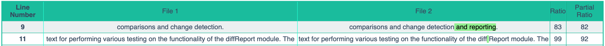
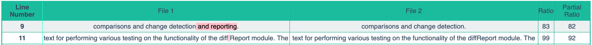

# diffReport
Python Package to report the differences between two files

## Installation

Run the following to install:

```python
pip install diffReport
```

## Usage

```python
from diffReport import diffReport

html = diffReport("file_path_a","file_path_b")
```

## Modules
### diffReport

FUNCTIONS

```
    diffReport(path_file_a, path_file_b, path_file_output='', html_return=True, partial_ratio='tokenSortRatio')
            :param path_file_a: Path for the File A to be compared.
            :param path_file_b: Path for the File B to be compared.
            :param path_file_output: Path of the directory where the output HTML file needs to be saved. (Default: 'Output/')
            :param html_return: Boolean to select if the function returns HTML of the report. (True by default)
            :param partial_ratio: Partial Ratio Type, Accepted Values are ("Ratio", "qRatio", "wRatio", "ratio_2", "tokenSetRatio", "tokenSortRatio", "partialTokenSortRatio", "default")
            :return: HTML for the report if html_return is set to True.  If set to false, it will return the DataFrame.
            
```
    
Function takes two PDF file paths as input, and generates a difference report with the lines that are different in the two files, and also highlighting the differences in an HTML table with colors to represent content that was Added, Removed or changed.
        
Any text that is present in File_a but not File_b is marked in Red.

Any text that is present in File_b but not File_a is marked in Green.

Any text that is neither present in string_a but nor string_b is marked in Yellow.
   
```
    html_output(df, path_file_output)
        :param df: Data Frame to be displayed as an HTM Table
        :param path_file_output: Path of the directory where the output HTML file needs to be saved. (Default: 'Output/')
        :return: Returns the HTML for the table generated.
     
``` 
       
The function accepts the Data frame as an argument to iterate through the rows and generate an HTML table with

### markUp

FUNCTIONS
```
    markUpDifferences(string_a, string_b)
        :param string_a: String one to compare
        :param string_b: String two to compare :return: String A, String B after
        
```
marking both strings with <insert>,<replace> and <delete> tags by comparing the differences between the two
strings.

        
Any text that is present in string_a but not string_b is marked with a <delete> markup tag.
```python
    markUpDifferences("Hello World !","Hello !")
```
```commandline
    returns >> "Hello <delete>World </delete>!"
```
Any text that is present in string_b but not string_a is marked with a <insert> markup tag.
```python
    markUpDifferences("Hello !","Hello World !")
```
        returns >> "Hello <insert>World </insert>!"
        
Any text that is neither present in string_a but nor string_b is marked with a <replace> markup tag. 
```python
    markUpDifferences("Brown Fox","Brown Box")
```
        returns >> "Brown <replace>F</replace>ox"
####

    mark_green(string)
        :param string: String to be marked
        :return: returns a String with markup tags
        
Function appends <insert></insert> markup tags to the input strings as prefix and suffix to return a marked string.

    
    mark_red(string)
        :param string: String to be marked
        :return: returns a String with markup tags
        
Function appends <delete></delete> markup tags to the input strings as prefix and suffix to return a marked string.

    
    mark_yellow(string)
        :param string: String to be marked
        :return: returns a String with markup tags
        
Function appends <replace></replace> markup tags to the input strings as prefix and suffix to return a marked string.

### fuzzyCompare

FUNCTIONS

    partialRatio(t1, t2)
        :param t1: Text string 1
        :param t2: Text String 2
        :return: Returns the Partial Ratio score etween the two given text
        
Function to calculate the ratio of the most similar substring as a number between 0 and 100.
        
Example : "" and "" returns a score of :
    
    partialTokenSortRatio(t1, t2)
        :param t1: Text string 1
        :param t2: Text String 2
        :return: Returns the Partial Token Sort Ratio score between the two given text
        
Function to calculate the ratio of??????????????????????????
        
Example : "" and "" returns a score of :
    
     qRatio(t1, t2)
        :param t1: Text string 1
        :param t2: Text String 2
        :return: Returns the Q Ratio score between the two given text
        
Function to calculate the ratio of??????????????????????????
        
Example : "" and "" returns a score of :
    
    ratio(t1, t2, ratio_type='default')
    
    tokenSetRatio(t1, t2)
        :param t1: Text string 1
        :param t2: Text String 2
        :return: Returns the Token Set Ratio score between the two given text
        
Function to calculate the ratio of??????????????????????????
        
Example : "" and "" returns a score of :
    
    tokenSortRatio(t1, t2)
        :param t1: Text string 1
        :param t2: Text String 2
        :return: Returns the Token Sort Ratio score between the two given text
        
Function to calculate the ratio of??????????????????????????
        
Example : "" and "" returns a score of :
    
    wRatio(t1, t2)
        :param t1: Text string 1
        :param t2: Text String 2
        :return: Returns the W Ratio score between the two given text
        
Function to calculate the ratio of??????????????????????????
        
Example : "" and "" returns a score of :

### pdfParser

FUNCTIONS

    pdfparser(path)
        
Function that takes a path of a PDF file as input and extracts the text within the file as a string

